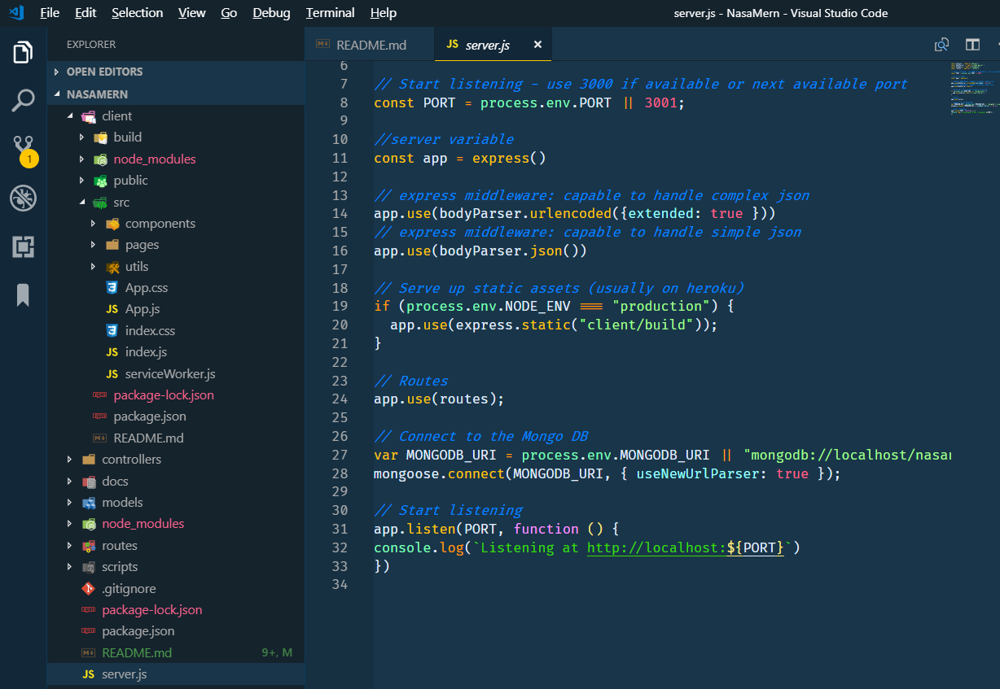
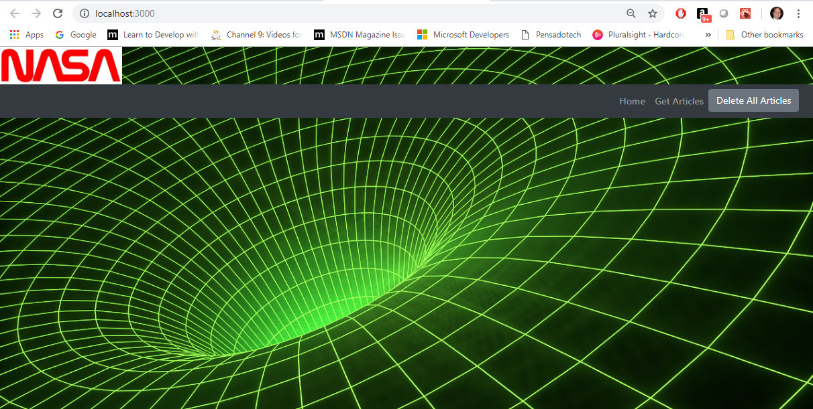

# Nasa news (MERN)

NASA news application

_by Armando Pensado_ 


## Description

The application helps the user searching for information at NASA breaking news RSS (https://www.nasa.gov/rss/dyn/breaking_news.rss) and presents articles to the user, giving the capability to store in the database articles that are considered interesting.

The application may seem similar to a previous one I created ( News Mongo Scraper: https://github.com/pensadotech/NewsMongoScraper ), but this application brings all its functionality into a true MERN application (Single page application with React).

This is an exercise that embodies a MERN application. It uses **Mongo DB**, **Express**, **React**, and **Node JS** (MERN). However, it also uses **mongoose (ODM)**, **axios**, and **cheerio** libraries.

* ref: https://www.mongodb.com/blog/post/the-modern-application-stack-part-1-introducing-the-mean-stack

The application layout is depicted below and a running version of the applicaiton can be found at: https://calm-oasis-74689.herokuapp.com/


## How does it works

The single page application offers two views: 

* the home view is to visualize any stored articles, and 
* the scrape view is to retrieve news from NASA.

The scrape view is where the user can retrieve articles and can save them into the DB for later use.  The home view allows the user to see all stored articles and delete the ones that are no longer used. The user can delete one article at a time, or all of them with a click of a button.

Consider launching the application. Once it is open, the menu will offer the option that reads _‘Get Articles’_ to help moving to the second view where the user can start retrieving Articles from NASA news feed.


In the view to scrape articles, by hitting the button _‘Scrape Articles’_, the system will connect to the NASA news feed and retrieve all available articles, presenting them to the user.


For the articles that interest the user, by clicking the _'Save Article'_ button, the system save a selected article into the database, and removes it from the view. The user can continue selecting many articles and when done, the _'Home'_ link will return the user to the home view, and all saved artciles will be listed.

There is a _'Read more'_ button for recently retreived or saved articles, which offers the full article in a separate tab in the internet browser.

The user can also hit the _‘Clear Screen'_ to remove the retrieved articles from teh scrape view. The Scrape view holds any retrievied article in memory and these are thrown away after the session ends. 

This scrape view is going through an express route that uses **axios** and **cheerio** libraries to do the retreive NASA news.


In the main view, any article stored in the database will be presented to the user. In here, the user can also select the _'Read more'_ button to read the full article. This artcles will stay stored in the DB unless are removed by the user.

If the article is no longer of interest, the user can select the _'Delete Article'_ button to remove it from the database. If the user wants to clear the total list of articles in the database, the _'Delete All Articles'_ offers such capability.


## Who can benefit from this application

This application is beneficial for NodeJS/React developer, providing a sample programming structures using JavaScript, using **Express**, **Mongo DB**, **mongoose (ODM)**, and API routes that encapsulate the logic to access the database.

## How developers can get started

To start, the developer must have NodeJS and Mongo DB installed in the computer. After, that the project can be cloned and initialized.  Here are the steps for getting started.

1. Install NodeJS into the computer  (https://nodejs.org/en/). Download button and run through the installation file.

2. Install Mongo DB (https://www.mongodb.com/)

3. Clone or Fork the project into the computer.

4. Bring all external module dependencies using VS Code terminal and type the command:

```js
npm i
```
After, the initialization, and using Microsoft Visual Code, the project folder should resemble as depicted below, and should be ready for execution.



To start the application, in VS Code terminal type teh following command

```js
npm start
```
The application will have no data, but should looks as depicted below. From this point the user can start experimenting with it.




## Who maintains and contributes to the project

This is a project for my personal learning process.

## Where users can get help with the project

* NodeJs   : https://nodejs.org/en/
* Express  : https://www.npmjs.com/package/express
* mongoDB  : https://www.mongodb.com/
* mongoose : https://mongoosejs.com/
* axios    : https://www.npmjs.com/package/axios
* cheerio  : https://www.npmjs.com/package/cheerio
* React Organization: https://reactjs.org/


## Buillding a MERN application

To understand how this MERN application was put together, please reference the following article in GitHub.

https://github.com/pensadotech/MERN_BlankApp

