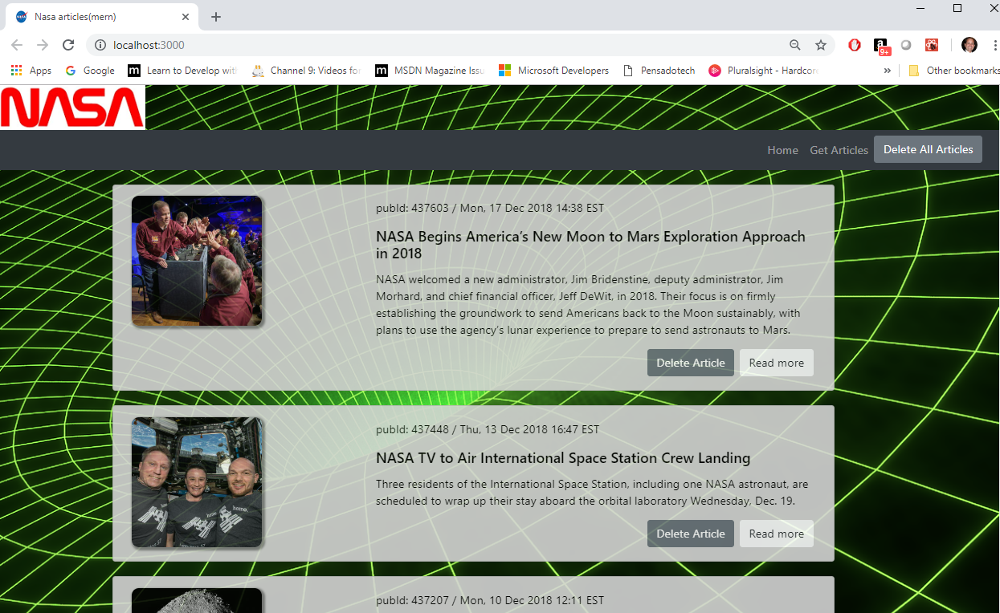
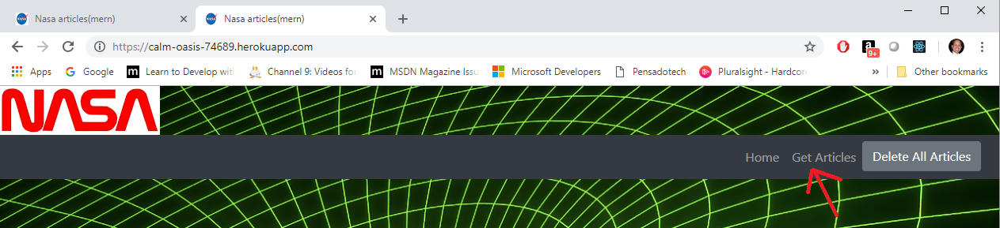
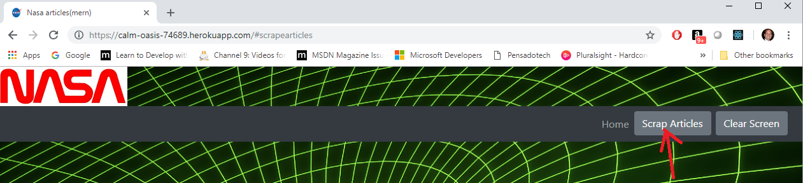
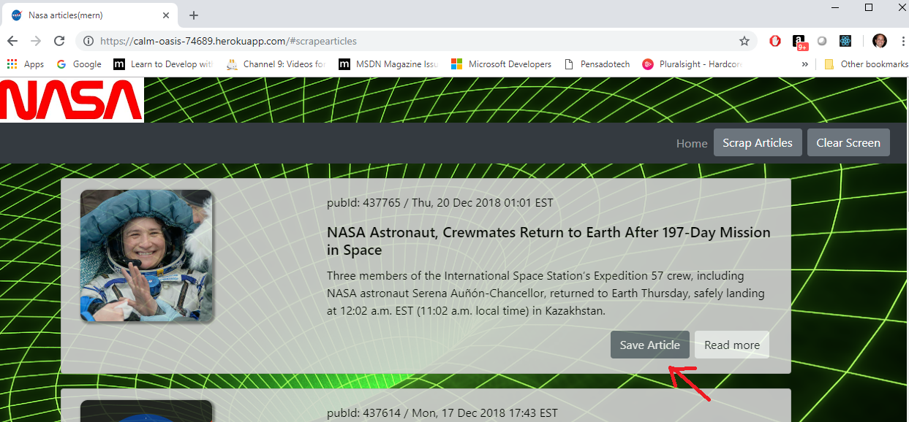
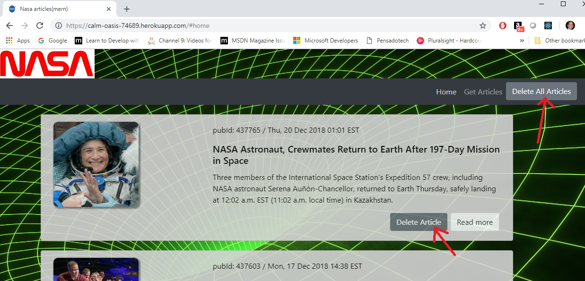

# Nasa news (MERN)

NASA news application

_by Armando Pensado_ 

## Description

This is an exercise that embodies a MERN an application. The application uses **Mongo DB**, **Express**, **React**, and **Node JS**. However, it also uses **mongoose (ODM)**, **axios**, and **cheerio** libraries.

The application search for information at NASA breaking news RSS (https://www.nasa.gov/rss/dyn/breaking_news.rss) and presents the articles to the user, giving the capability to store in the database articles that are interesting for the user.

The application may seem similar to a previous one I created ( News Mongo Scraper: https://github.com/pensadotech/NewsMongoScraper ), but this application brings all this functionality into a true MERN application (Single page application).

The applicaiton is depicted as follows:

A running version of the applicaiton can be found at:

https://calm-oasis-74689.herokuapp.com/

## How does it works

The application offers two views, a) the home view is to visualize any stored articles, and b) the scrape view is to retrieve news from NASA.

The scrape view is where the user can look at the retrieved articles and can save them into the DB for later use.  The home view allows the user to see all stored articles and delete them when are no longer used. The user can delete ne article at a time or all of them.

Once the application is open, the menu will offer the option that reads ‘Get Articles’ to move to the second view where the user can start retrieving Articles.

In the view to scrape articles, by hitting the button ‘Scrape Articles’, the system will connect to the NASA news feed and retrieve all available articles, presenting them to the user.

For articles that interest the user, by clicking the “Save Article” button, the article is stored into the database, and removed from the screen. The user can continue selecting many articles and when done, these will now be visible in the main view.

There is also a “Read more” button that can offer the full article in a separate tab in the internet browser.

The user can also hit the ‘Clear Screen” to remove the retrieved articles. This view is thrown away after the session end. However, it can be cleared and can recall NASA news as many times as needed.

The second view is going through an express route that uses “axios” and “cheerio” libraries to do the work.

In the main view, any article stored in the database will be retrieved and presented to the user. In here, the user can also select the “Read more” button that can offer the full article in a separate tab in the internet browser.

If the article is no longer of interest, the user can select the “Delete Article” button to remove it from the database. 

If the user wants to clear the total list of articles in the database, the “Delete All Articles” offers such capability.

## Who can benefit from this application

This application is beneficial for NodeJS/React developer, providing sample programming structures using JavaScript, and using **Express**, **Mongo DB**, **mongoose (ODM)**, and API routes that encapsulate the logic to access the database.

## Dependedencies

npm init -y 
npm i express mongoose body-parser
npm i if-env
npx create-react-app client 
npm i axios   // Inside the /package.json and client/package.json
npm i cheerio 
npm i react-router-dom // Inside the client/package.json

## MERN Tiricks and ideas

* Under development (laptop), the solution will execute essentially  the react portion inside the "client/src" folder using "webpack dev server". However, when in production, the "server.js" will be executed.

* The react-router-dom need to be Inside the "client/package.json". Install at root level, but then copy refrence from "/package.json+ and add it into "client/package.json". re-initialize the project using "npm i" to make sure all dependencies are brought over.

* Axios need to be refrenced in both "/package.json" and "client/package.json". Install at root level and the copy refrence inside the "client/package.json". re-initialize the project using "npm i" to make sure all dependencies are brought over.

* Create API routes at '/routes', using express router. Thies need to be connected with the 'controller' libraries, which holds all libaries to access teh database or any externla AJAX calls.

* Inside teh clinet/src, ceate a "utils" folder, and inside create an API library ("API.js") that will be used for the react code to invoke the express routes. This is the bridge between the react geenrated front end and the server functionality to manipulate data.

